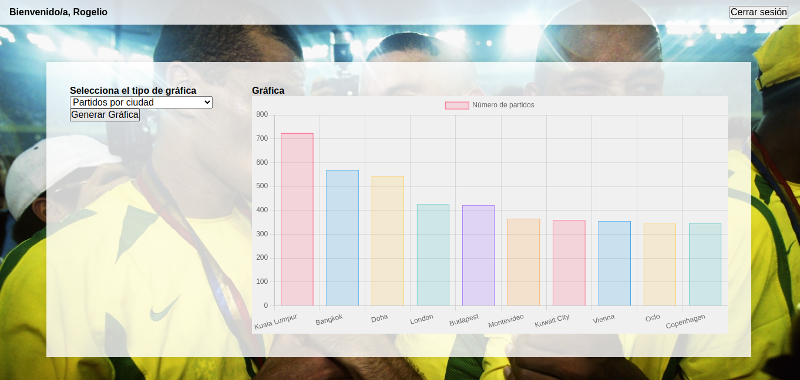
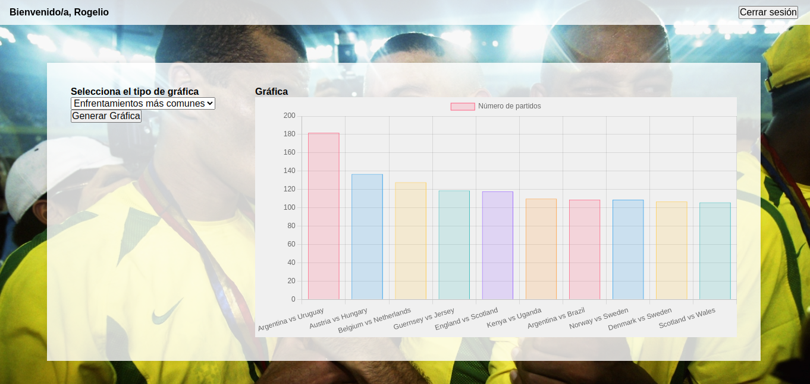
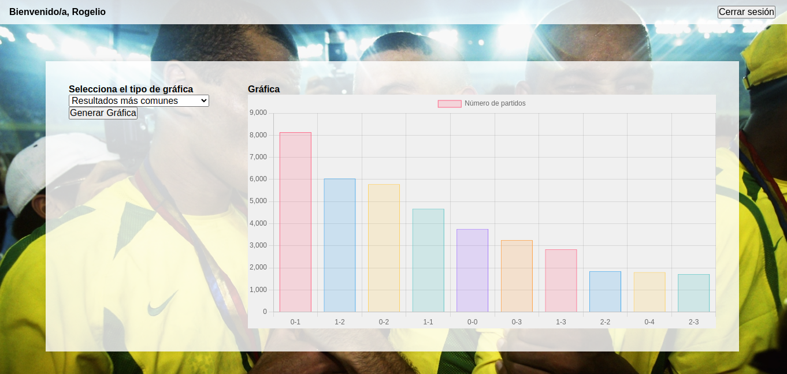

# Dashboard sobre partidos internacionales entre 1872-2024
 
###  Descripción:
Este es un proyecto utilizando javascript, node js y mysql crea un dashboard de una base de datos en donde se encuentran todos los resultados de partidos internacionales entre 1872-2024.
La base se descargo de [aqui](https://www.kaggle.com/datasets/martj42/international-football-results-from-1872-to-2017)





### Requisitos:
1. Se requieren dos bases de datos para este proyecto, que se encuentran en el repositrio dentro de la carpeta databases en formato mysql ,se recomienda el uso de xampp.

2.MariaDB v10.4.32

3.Nodejs v20.12.2

### Intstrucciones de uso:
1.Utiliza el siguiente comando para clonar el repositorio:
```git clone https://github.com/rgperalta04/BAMX```
2.Instala las dependias necesarias.

3.Ahora corremos el programa ejecutando lo siguiente en tu terminal:
```node server.js```
